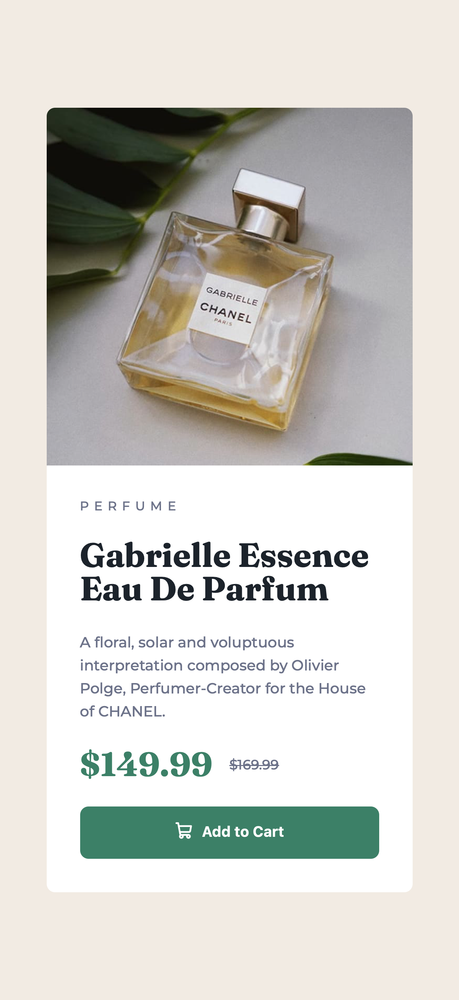
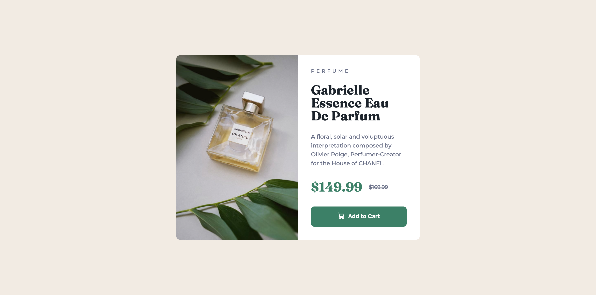

# Frontend Mentor - Product preview card component solution

This is a solution to the [Product preview card component challenge on Frontend Mentor](https://www.frontendmentor.io/challenges/product-preview-card-component-GO7UmttRfa).

## Table of contents

- [Overview](#overview)
  - [The challenge](#the-challenge)
  - [Screenshot](#screenshot)
  - [Links](#links)
- [My process](#my-process)
  - [Built with](#built-with)
  - [What I learned](#what-i-learned)
  - [Continued development](#continued-development)
  - [Useful resources](#useful-resources)
  - [AI Collaboration](#ai-collaboration)
- [Author](#author)
- [Acknowledgments](#acknowledgments)

## Overview

### The challenge

Users should be able to:

- View the optimal layout depending on their device's screen size
- See hover and focus states for interactive elements

### Screenshot




### Links

- Solution URL: [https://github.com/Qusbee/preview-card](https://github.com/Qusbee/preview-card)
- Live Site URL: [https://qusbee.github.io/preview-card/](https://qusbee.github.io/preview-card/)

## My process

### Built with

- Semantic HTML5 markup
- CSS custom properties
- Flexbox
- Mobile-first workflow
- `<picture>` element for art direction

### What I learned

**Swapping images with `<picture>` instead of CSS.** The challenge ships two different crops of the product photo, so this is art direction, not just resolution switching. Using `<picture>` with a `media` query on `<source>` keeps a single `` in the markup — one `alt`, one element for the browser to load — and the browser picks the right file before it starts downloading:

```html
<picture class="card__picture">
  <source media="(min-width: 600px)" srcset="images/image-product-desktop.jpg">
  
</picture>
```

**Reserving space with `aspect-ratio`.** Before I added this, the card visibly jumped as soon as the image finished loading. Giving the wrapper the image's own ratio and letting the image fill it with `object-fit: cover` removed the layout shift completely:

```css
.card__picture {
  display: block;
  width: 100%;
  aspect-ratio: 700 / 684;
}

.card__image {
  width: 100%;
  height: 100%;
  display: block;
  object-fit: cover;
}
```

**Choosing the right semantic element for the old price.** My first version used a `<span>` with a line-through. `<del>` says the same thing to a screen reader that the strikethrough says visually — this price no longer applies:

```html
<div class="card__price">
  <span class="card__price-new">$149.99</span>
  <del class="card__price-old">$169.99</del>
</div>
```

**`:focus-visible` alongside `:hover`.** Styling both in one rule means keyboard users get the same clear state as mouse users, without a focus ring appearing on every mouse click.

**Small things that added up:** `100dvh` instead of `100vh` so mobile browser chrome doesn't cut off the centering; `rem` for sizes so the layout respects the user's font settings; custom properties for the whole palette, which made the style guide colors a one-time transcription instead of numbers scattered through the file.

### Continued development

- **Breakpoint choice.** I used `600px` because that's where the card stops looking cramped, not because it matches a device. I want to get more comfortable picking breakpoints from the content and eventually try `clamp()` and container queries instead of media queries where they fit.
- **Fluid typography.** Font sizes are still fixed per breakpoint. I'd like to try scaling them fluidly.
- **BEM discipline.** The naming holds up here, but this is a single component. I want to see how it behaves on a page with several blocks.
- **Accessibility.** Basic focus and semantics are covered; next I want to actually test with a screen reader rather than assuming.

### Useful resources

- [MDN — `<picture>`](https://developer.mozilla.org/en-US/docs/Web/HTML/Element/picture) - Explained the difference between art direction and resolution switching, which is what made me pick `<picture>` over a CSS background swap.
- [MDN — `aspect-ratio`](https://developer.mozilla.org/en-US/docs/Web/CSS/aspect-ratio) - Helped me fix the layout shift on image load.
- [MDN — `:focus-visible`](https://developer.mozilla.org/en-US/docs/Web/CSS/:focus-visible) - Clarified why it's better than plain `:focus` for hover-style states.
- [CSS Tricks — A Complete Guide to Flexbox](https://css-tricks.com/snippets/css/a-guide-to-flexbox/) - My go-to reference for `gap`, alignment and direction switching.
- [BEM — Naming](https://en.bem.info/methodology/naming-convention/) - Kept my class names consistent throughout.

### AI Collaboration

I used **Claude (Claude Code)** on this project, mostly as a reviewer rather than a code generator. The repo has an `AGENTS.md` file that sets the ground rules: explain, don't hand over finished code.

How I used it:

- **Code review after each step.** I wrote the markup and CSS myself, then asked for feedback. That's how the heading hierarchy fix and the switch to `<del>` came about.
- **Understanding the "why".** When it suggested `aspect-ratio` for the layout shift, I asked it to explain what was actually happening in the browser instead of just taking the snippet.
- **Naming and structure.** Useful as a second opinion on BEM class names and on whether a wrapper element was earning its place.

What worked well: having something to explain a concept at exactly the moment I hit it, and catching semantic mistakes I couldn't see myself.

What didn't: when I asked broad questions ("is this good?"), I got broad answers. It's far more useful with a specific question about a specific line. It also tends to suggest more abstraction than a component this size needs — I turned down a few refactors.

## Author

- Frontend Mentor - [@Qusbee](https://www.frontendmentor.io/profile/Qusbee)
- GitHub - [@Qusbee](https://github.com/Qusbee)

## Acknowledgments

Thanks to Frontend Mentor for the challenge and the design files — having a real design to match is what makes the small details (letter spacing, line height, exact paddings) worth chasing.
